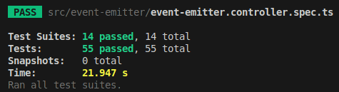
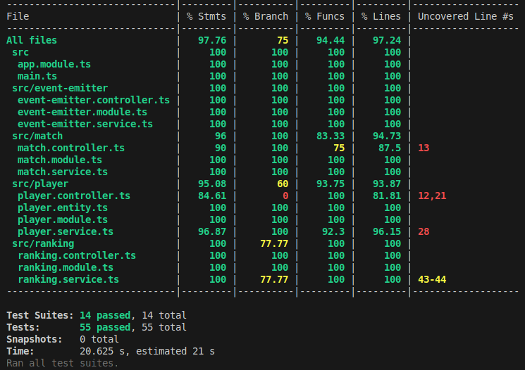
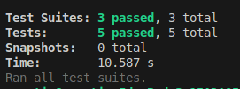

###  Realtime Elo Ranker - Classement Elo en Temps Réel  

Realtime Elo Ranker est une application web qui permet de simuler des matchs entre joueurs et de mettre à jour leur classement Elo en temps réel. Elle fournit une interface intuitive et une API robuste pour gérer les joueurs, enregistrer les matchs et suivre les classements dynamiques.

---

##  Développeur  

- **Nom** : PREVOST  
- **Prénom** : Maverick  
- **GitHub** : [PrevostMaverick](https://github.com/PrevostMaverick)  

---

##  Installation du Projet  

Avant de commencer, assurez-vous d'avoir une version récente de **Git** et **cURL** installée sur votre système.  

###  Linux : 

###  Étape 1 : Nettoyage des dépendances existantes  

Si vous avez déjà installé le projet auparavant, commencez par supprimer les dépendances obsolètes :  

```bash
rm -rf node_modules pnpm-lock.yaml
```

###  Étape 2 : Installation de NVM (Node Version Manager)  

```bash
curl -o- https://raw.githubusercontent.com/nvm-sh/nvm/v0.40.1/install.sh | bash
```

Rechargez ensuite votre terminal ou exécutez :  

```bash
source ~/.bashrc  # ou source ~/.zshrc si vous utilisez zsh
```

###  Étape 3 : Installation de Node.js via NVM  

Installez la version requise de Node.js (v22) et définissez-la comme version par défaut :  

```bash
nvm install 22
nvm use 22
nvm alias default 22
```

###  Étape 4 : Installation de PNPM (Gestionnaire de Paquets)  

```bash
corepack enable pnpm
corepack use pnpm@8
```

###  Étape 5 : Installation des Dépendances  

Installez toutes les dépendances nécessaires au bon fonctionnement du projet :  

#### EventEmitter  
```bash
npm install eventemitter2 @nestjs/event-emitter@^3.0.0
```

#### Base de Données (TypeORM + SQLite)  
```bash
npm install @nestjs/typeorm@^11.0.0 sqlite3@^5.1.7 typeorm@^0.3.20
```

#### Outils de Tests  
```bash
npm install --save-dev @nestjs/testing jest @types/jest ts-jest
pnpm add -D jest supertest
```

---

###  Windows : 


### Étape 1 : Suppression des dépendances**
Dans PowerShell ou Git Bash, exécute :
```powershell
rm -r -fo node_modules pnpm-lock.yaml
```
Ou en **Invite de commande (cmd)** :
```cmd
rmdir /s /q node_modules pnpm-lock.yaml
```


### Étape 2 : Installation de NVM pour Windows**
Windows ne supporte pas `nvm` natif. À la place, installe **nvm-windows** :

1. Télécharge `nvm-windows` ici 👉 [https://github.com/coreybutler/nvm-windows/releases](https://github.com/coreybutler/nvm-windows/releases)
2. Installe-le comme un logiciel classique.
3. Redémarre ton terminal après l'installation.


### Étape 3 : Installation de Node.js avec NVM**
Une fois `nvm-windows` installé, exécute dans **PowerShell** :
```powershell
nvm install 22
nvm use 22
nvm alias default 22
```
 **Vérification** :  
```powershell
node -v
```
Cela doit afficher `v22.x.x`.


### Étape 4 : Installation de PNPM**
Active **Corepack** (inclus avec Node.js) pour utiliser `pnpm` :
```powershell
corepack enable pnpm
corepack use pnpm@8
```
 **Vérification** :
```powershell
pnpm -v
```
Cela doit afficher `8.x.x`.


### Étape 5 : Installation d'EventEmitter**
```powershell
npm install eventemitter2
npm install @nestjs/event-emitter@^3.0.0
```


### Étape 6 : Installation des dépendances pour TypeORM et SQLite**
```powershell
npm install @nestjs/typeorm@^11.0.0 sqlite3@^5.1.7 typeorm@^0.3.20
```


### Étape 7 : Installation des dépendances pour les tests**
```powershell
npm install --save-dev @nestjs/testing jest @types/jest ts-jest
pnpm add -D jest supertest
```

---


##  Lancement du Projet  

Placez-vous à la racine du projet et utilisez les commandes suivantes pour exécuter chaque composant :  

### 1. Compilation de la source CSS (libs/ui)  
```bash
pnpm run libs:ui:build
```

### 2. Lancement du Serveur  
```bash
pnpm apps:server:dev
```

### 3. Lancement du Client  
⚠️ **Le serveur doit être lancé en premier !**  
```bash
pnpm apps:client:dev
```
👉 Le client sera accessible via [http://localhost:3001](http://localhost:3001).  

### 4. Lancement de la Documentation Swagger  
```bash
pnpm docs:swagger:start
```
👉 Disponible sur [http://localhost:3001/api-docs](http://localhost:3001/api-docs).  

###  Exécution des Tests  

#### Tests unitaires et d'intégration  
```bash
cd apps/realtime-elo-ranker-server/
pnpm test
```

#### Tests End-to-End (E2E)  
```bash
pnpm test:e2e
```

#### Couverture des tests  
```bash
pnpm test:cov
```

---

##  Architecture du Projet  

L’application suit une **architecture modulaire MVC** :  

- **Modules** : Séparation claire des domaines fonctionnels  
- **Contrôleurs** : Gestion des requêtes HTTP  
- **Services** : Contient la logique métier  
- **Données** : Stockage en RAM + base SQLite  

###  Organisation des Modules  

| Module            | Fonctionnalité |
|------------------|---------------|
| `event-emitter`  | Gestion des événements en temps réel |
| `match`          | Gestion des matchs et calcul des scores Elo |
| `player`         | Gestion des joueurs |
| `ranking`        | Gestion des classements |

---

##  Gestion des Routes  

###  1. Création d’un Joueur  
 **Route** : `POST /api/player`  
 **Body** :  
```json
{ "id": "player1" }
```
 **Réponse** :  
```json
{ "id": "player1", "rank": 1000 }
```

---

###  2. Publication d’un Résultat de Match  
 **Route** : `POST /api/match`  
 **Body** :  
```json
{
  "winner": "player1",
  "loser": "player2",
  "draw": false
}
```
 **Réponse** :  
```json
{
  "winner": { "id": "player1", "rank": 1200 },
  "loser": { "id": "player2", "rank": 980 }
}
```

---

### 3. Récupération du Classement  
 **Route** : `GET /api/ranking`  
 **Réponse** :  
```json
[
  { "id": "player1", "rank": 1200 },
  { "id": "player2", "rank": 980 }
]
```

---

###  4. Mise à Jour du Classement en Temps Réel  
 **Route** : `GET /api/ranking/events`  
 **Exemple d’événement envoyé** :  
```json
{
  "type": "RankingUpdate",
  "player": { "id": "player1", "rank": 1250 }
}
```

---

##  Gestion des Événements  

L'application utilise **EventEmitter2** pour notifier en temps réel les mises à jour du classement.  

 **Exemple d’émission d’un événement** :  
```typescript
this.eventEmitterService.emit('RankingUpdate', { id: "player1", rank: 1250 });
```

---

##  Base de Données (SQLite + TypeORM)  

 **Configuration dans `app.module.ts`**  
```typescript
TypeOrmModule.forRoot({
  type: 'sqlite',
  database: 'db.sqlite',
  entities: [__dirname + '/**/*.entity{.ts,.js}'],
  synchronize: true,
})
```

 **Modèle PlayerEntity**  
```typescript
@Entity()
export class PlayerEntity {
  @PrimaryGeneratedColumn()
  playerId: number;

  @Column()
  id: string;

  @Column()
  rank: number;
}
```

---

##  Tests et Couverture  

Le projet utilise **Jest** pour les tests unitaires et d’intégration.  

 **Structure des fichiers de test**  
```
src/
 ├── player/
 │    ├── player.service.ts
 │    ├── player.service.spec.ts  <-- Tests unitaires
 │    ├── ...
 ├── match/
 │    ├── match.service.ts
 │    ├── match.service.spec.ts
 │    ├── ...
 ...
```

 **Taux de couverture** : ✅ **97,76%**  

---

##  Captures d’Écran  

 **Interface de l’application**  
  

 **Base de données SQLite**  
  

 **Tests**
 
 
 

---

##  Objectifs et Améliorations Futures  

✅ **Gestion des classements en temps réel**  
✅ **Tests unitaires et d'intégration robustes**  
🔜 **Ajout d’un front-end plus interactif**  
🔜 **Support d'autres bases de données (PostgreSQL, MongoDB, etc.)**  

---

📌 **Développé avec par Maverick Prevost**  
👉 [GitHub](https://github.com/PrevostMaverick) 
